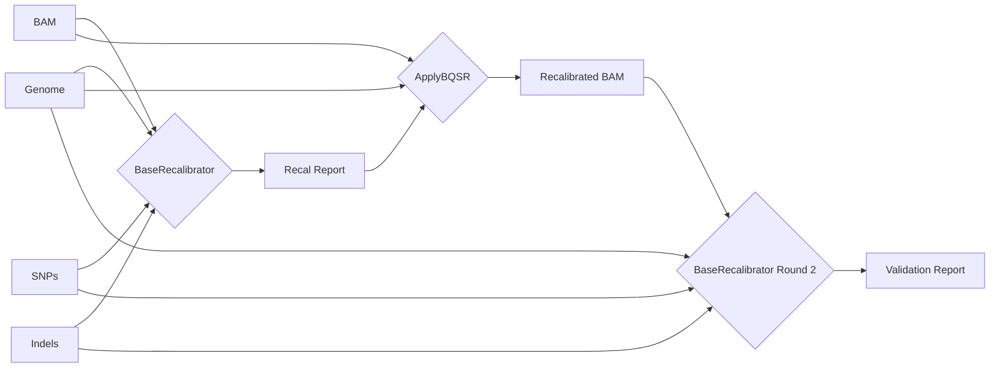

# mobq

Marine Omics implementation of GATK workflow for Base Quality Score Recalibration



**Note:** This workflow is still in draft. It needs automated tests and better documentation

## Usage

Required inputs are a genome, a set of bam files on which you want to perform recalibration and reference SNP and indel data.  The reference data should attempt to include all variant sites.  When working with non-model organisms this generally means you need a WGS dataset from the relevant population that has a decent sample size and good coverage depth. Filtering on the vcf should be light to moderate filtering only (eg according to GATK variant filtering guidelines).

Example command shown below

```bash
nextflow run marine-omics/mobq \
	-profile singularity \
	-r main -latest \
	--genome aten_final_0.11.fasta \
	--bams bams.csv \
	--snps snps.vcf.gz \
	--indels indels.vcf.gz \
	--outdir out \
	-w work \
	-resume 
```

